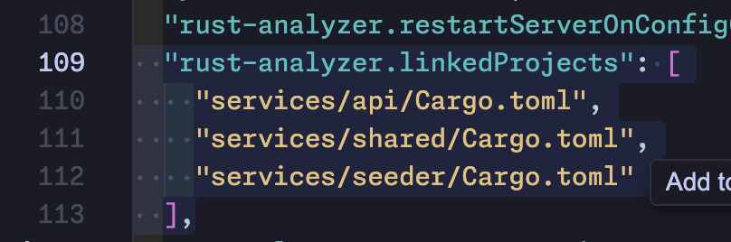

#### "proc-macro crate is missing its build data"

```
cargo clean
cargo build
```
and also make sure that if you're using the rust-analyzer plugin, ensure that `rust-analyzer.linkedProjects` directories are correct, usually in a `settings.json` file in your IDE.

